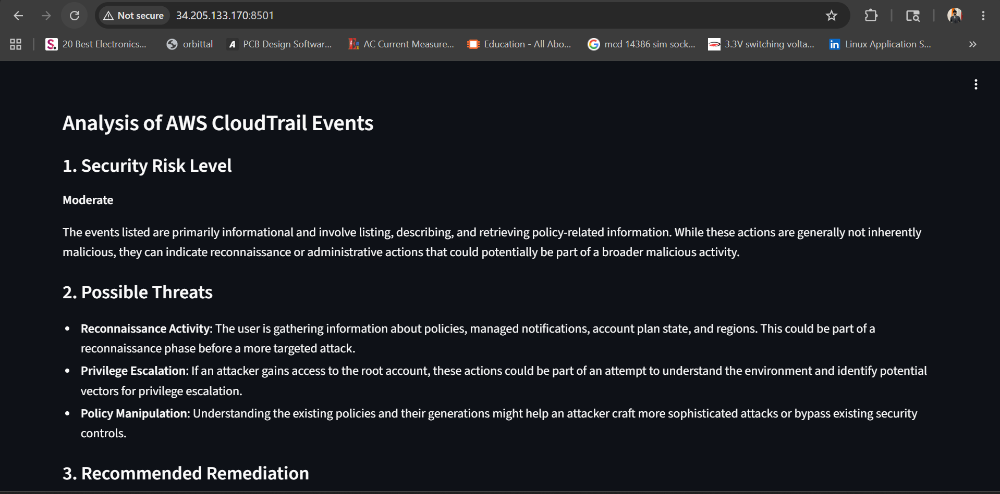
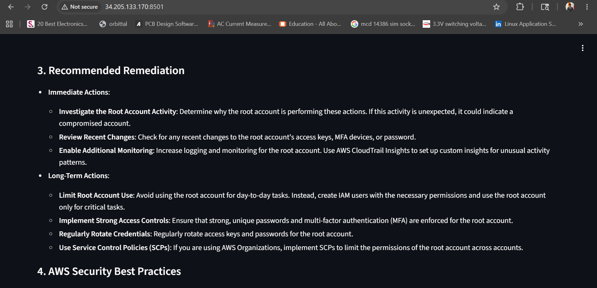
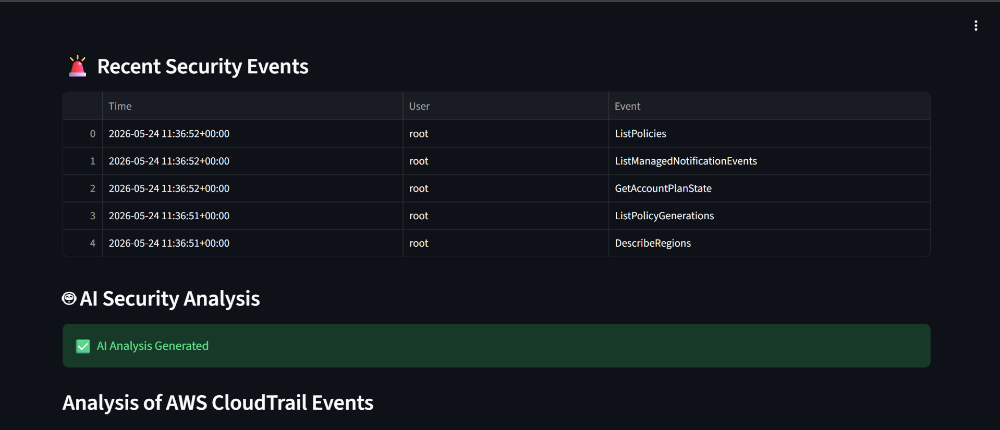
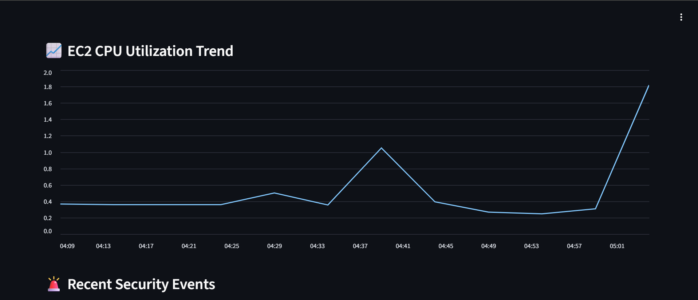
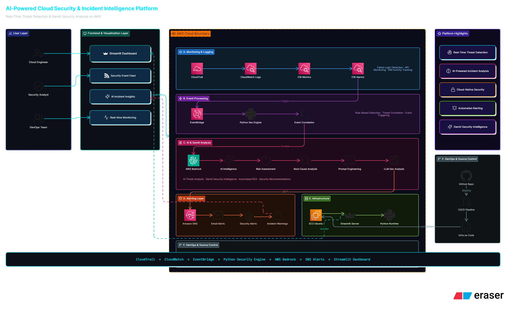
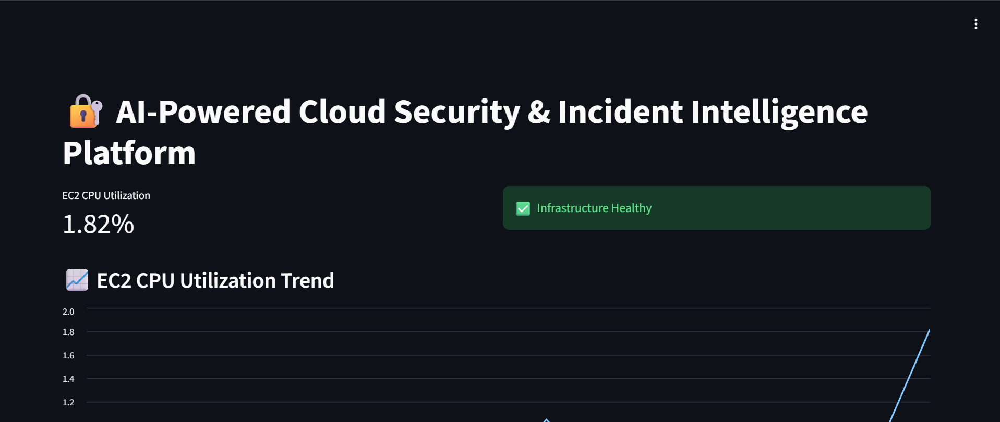

# Features
- AI-powered security analysis
- CloudTrail monitoring
- Real-time alerts
- AWS Bedrock integration
- Streamlit dashboard

# Tech Stack
- AWS EC2
- AWS CloudTrail
- AWS EventBridge
- AWS SNS
- AWS Bedrock
- Python
- Streamlit

# Security Analysis

# Security Events Monitoring

# EC2 CPU Monitoring

# Architecture Diagram

# Streamlit Dashboard

# EC2 CPU Monitoring

